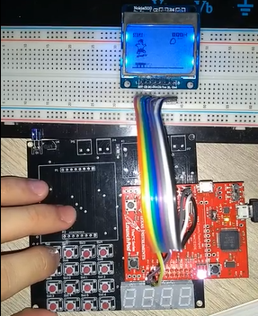

# Am Skater Game
Microcontrollers subject final project based on the *Am Skater* game from Surfvey, Inc. Project developed using the C language in a Tiva C Series microcontroller (TM4C123G) with a Nokia LCD display and a matrix keypad

## Features
- Obstacles to jump
- Up to 4 skate tricks, with a new one every stage
- Speed gets higher every stage
- Menu with how-to-play instructions
- Score